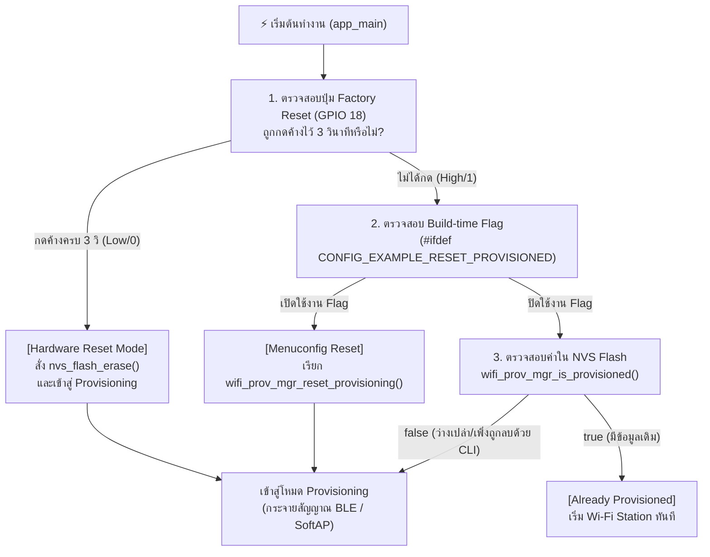

# ใบงานที่ 7.1  การศึกษากลไก Reset Provisioning 3 รูปแบบ และ NVS Memory Forensics

## 0. กล่าวนำ (Introduction)
เมื่ออุปกรณ์ ESP32 ผ่านการ Provisioning สำเร็จแล้ว ข้อมูล Wi-Fi จะถูกบันทึกไว้ใน NVS Flash Memory อย่างถาวร เมื่อเปิดเครื่องใหม่ เฟิร์มแวร์จะเข้าสู่สถานะ `Already provisioned` และข้ามขั้นตอนการรับข้อมูลใหม่ไปทันที

ในการพัฒนาผลิตภัณฑ์และการทดสอบความปลอดภัย วิศวกรจำเป็นต้องทราบวิธีการล้างค่าคอนฟิก (Factory Reset / Erase Credentials) ซึ่งในใบงานนี้นักศึกษาจะได้ทดลองและเปรียบเทียบกลไกการ Reset ครบทั้ง 3 รูปแบบ:
1. **Developer CLI Reset:** การล้างผ่านคำสั่ง Command Line บนเครื่องคอมพิวเตอร์
2. **Build-time Firmware Reset:** การกำหนดค่าผ่าน `menuconfig`
3. **Consumer Hardware Reset:** การต่อสวิตช์ปุ่มกดภายนอก (**External Pushbutton บน GPIO 18**) เพื่อใช้เป็นปุ่ม Factory Reset ทางกายภาพ เสมือนอุปกรณ์ IoT เชิงพาณิชย์จริง (หลีกเลี่ยงการใช้ปุ่ม BOOT/GPIO 0 ที่เป็น Strapping Pin)

---

## 1. วัตถุประสงค์ (Objectives)
1. ศึกษาและทำความเข้าใจสถานะ `Already provisioned` และการตัดสินใจของ `wifi_prov_mgr_is_provisioned()`
2. สามารถล้างข้อมูลการเชื่อมต่อใน Flash Memory ผ่านคำสั่ง CLI (`idf.py erase-flash` และ `esptool.py`) ได้
3. สามารถกำหนดค่า Build Configuration ใน `menuconfig` เพื่อสั่งรีเซ็ต State Machine ได้
4. เข้าใจข้อจำกัดของ **Strapping Pins (GPIO 0 / Bootloader Trap)** และสามารถต่อสวิตช์ปุ่มกดภายนอก (GPIO 18) เพื่อเขียนโปรแกรม Factory Reset ทางกายภาพได้อย่างถูกต้อง

---

## 2. อุปกรณ์ที่ใช้ในการทดลอง (Equipment)
1. บอร์ดไมโครคอนโทรลเลอร์ ESP32 พร้อมสาย USB
2. สวิตช์ปุ่มกด (Tactile Pushbutton Switch) จำนวน 1 ตัว พร้อมสายต่อ Breadboard
3. ESP-IDF Command Prompt (VS Code Terminal)

> [!IMPORTANT]
> **ทำไมจึงไม่ใช้ปุ่ม BOOT (GPIO 0) กดค้างตอนรีเซ็ตบอร์ด?**
> ขา **GPIO 0** บน ESP32 ทำหน้าที่เป็น **Strapping Pin** สำหรับเลือกโหมดการบูต หากขา GPIO 0 มีสถานะเป็น `LOW (0)` ในจังหวะที่บอร์ดถูกรีเซ็ตหรือจ่ายไฟ ชิป ESP32 จะเข้าสู่โหมด **ROM Download Bootloader** (`waiting for download`) ทันที ทำให้ตัวประมวลผลหยุดรอการแฟลชโปรแกรมและไม่รันโค้ด `app_main()` 
> 
> ดังนั้น ในการออกแบบอุปกรณ์เชิงพาณิชย์ จึงนิยมใช้ขา GPIO ทั่วไป (เช่น **GPIO 18**) ต่อร่วมกับปุ่มกดภายนอกเพื่อทำ Factory Reset แทน

---

## 3. สถาปัตยกรรมและการต่อวงจร (Hardware Wiring & Flow)

### 3.1 การต่อวงจรปุ่มกด Factory Reset (GPIO 18)
- ขาหนึ่งของสวิตช์ปุ่มกด $\rightarrow$ ต่อเข้าขา **GPIO 18** ของ ESP32
- อีกขาหนึ่งของสวิตช์ $\rightarrow$ ต่อลง **GND**
*(เปิดใช้งาน Internal Pull-up Resistor ในโค้ด จึงไม่ต้องต่อตัวต้านทานภายนอกเพิ่ม)*



---

## 4. ขั้นตอนการทดลอง (Step-by-Step Procedures)

### ตอนที่ 1 การล้าง Flash ผ่าน Command Line (Developer Level)
1. เสียบสาย USB เข้ากับคอมพิวเตอร์ ตรวจสอบหมายเลขพอร์ต COM (เช่น `COM24`)
2. เปิด Terminal ในโฟลเดอร์โปรเจกต์ `Week-07-W-iFi-Privisioning/Example_codes/Lab7-1-Reset-and-NVS-Forensics`
3. สั่งล้าง Flash Memory ทั้งหมดของชิปด้วยคำสั่ง:
   ```powershell
   idf.py -p COM24 erase-flash
   ```
4. ทำการ Flash โปรแกรมและเปิด Serial Monitor:
   ```powershell
   idf.py -p COM24 flash monitor
   ```
5. สังเกต Log ว่า ESP32 จะรายงานสถานะ `"Starting provisioning"` และสร้าง QR Code ขึ้นมาบนหน้าจอ

---

### ตอนที่ 2 การบังคับ Reset ผ่าน Menuconfig (Firmware Configuration Level)
1. กดปุ่ม `Ctrl + ]` เพื่อออกจาก Serial Monitor
2. เปิดหน้าต่างคอนฟิกโปรเจกต์:
   ```powershell
   idf.py menuconfig
   ```
3. ใช้ปุ่มลูกศรเลื่อนไปที่หัวข้อ **Example Configuration**
4. เลื่อนไปที่บรรทัด **`Reset Provisioned state (Erase credentials)`** แล้วกดปุ่ม `Spacebar` เพื่อเลือกให้มีเครื่องหมาย `[*]`
5. กดปุ่ม `S` เพื่อบันทึก และ `Q` เพื่อออกจากเมนู
6. สั่ง Build และ Flash โปรแกรม:
   ```powershell
   idf.py -p COM24 flash monitor
   ```
7. สังเกตผลลัพธ์ใน Log: บอร์ดจะทำการล้าง Credentials เก่าทิ้งทุกครั้งที่เปิดเครื่องใหม่

---

### ตอนที่ 3 การสร้างปุ่ม Factory Reset ด้วยฮาร์ดแวร์ภายนอก (GPIO 18)

1. นำสวิตช์ปุ่มกดต่อเข้ากับขา **GPIO 18** และ **GND**
2. เพิ่มฟังก์ชันตรวจสอบปุ่ม Factory Reset ลงในไฟล์ `main/main.c`:

```c
#include "driver/gpio.h"

#define FACTORY_RESET_BUTTON_GPIO  GPIO_NUM_18   // ปุ่ม Factory Reset ภายนอก (ต่อลง GND)

static bool check_factory_reset_button(void)
{
    // กำหนดค่า GPIO 18 เป็น Input พร้อมเปิด Internal Pull-up Resistor
    gpio_config_t io_conf = {
        .pin_bit_mask = (1ULL << FACTORY_RESET_BUTTON_GPIO),
        .mode = GPIO_MODE_INPUT,
        .pull_up_en = GPIO_PULLUP_ENABLE,
        .pull_down_en = GPIO_PULLDOWN_DISABLE,
        .intr_type = GPIO_INTR_DISABLE,
    };
    gpio_config(&io_conf);

    ESP_LOGI("FACTORY_RESET", "Hold GPIO 18 button for 3 seconds to trigger Factory Reset...");
    
    // ตรวจสอบสถานะปุ่มกดค้าง (Active Low / Logic 0)
    int hold_count = 0;
    while (gpio_get_level(FACTORY_RESET_BUTTON_GPIO) == 0) {
        vTaskDelay(pdMS_TO_TICKS(100));
        hold_count++;
        if (hold_count % 10 == 0) {
            ESP_LOGI("FACTORY_RESET", "Holding button... %d/3 seconds", hold_count / 10);
        }
        if (hold_count >= 30) { // กดค้างครบ 3 วินาที (30 x 100ms)
            ESP_LOGW("FACTORY_RESET", "=================================================");
            ESP_LOGW("FACTORY_RESET", ">>> FACTORY RESET TRIGGERED! ERASING NVS FLASH <<<");
            ESP_LOGW("FACTORY_RESET", "=================================================");
            return true;
        }
    }
    return false;
}
```

3. เรียกใช้งานในตอนเริ่มต้นของฟังก์ชัน `app_main()`:

```c
void app_main(void)
{
    // ตรวจสอบการกดปุ่ม Factory Reset ทางกายภาพ (GPIO 18)
    if (check_factory_reset_button()) {
        ESP_ERROR_CHECK(nvs_flash_erase());
    }

    /* Initialize NVS partition */
    esp_err_t ret = nvs_flash_init();
    if (ret == ESP_ERR_NVS_NO_FREE_PAGES || ret == ESP_ERR_NVS_NEW_VERSION_FOUND) {
        ESP_ERROR_CHECK(nvs_flash_erase());
        ESP_ERROR_CHECK(nvs_flash_init());
    }
    // ... โค้ดเดิมต่อจากนี้ ...
```

#### การทดสอบ:
1. ปล่อยให้บอร์ดทำงานปกติ $\rightarrow$ บอร์ดจะจำค่าเดิมได้ (`Already provisioned`)
2. กดปุ่มที่ต่อกับ **GPIO 18 ค้างไว้ 3 วินาที** จากนั้นกดรีเซ็ตบอร์ด หรือกดค้างขณะเปิดเครื่อง
3. สังเกต Serial Monitor: ระบบจะตรวจพบการกดค้าง 3 วินาที และสั่งล้าง NVS Flash เพื่อกลับสู่โหมด Provisioning ทันที!

---

---

## 5. กิจกรรมถอดรหัสซอร์สโค้ดและเขียนผังงาน (Code Deconstruction & Flowchart Assignment)

ให้นักศึกษาศึกษาโค้ดใน `main/main.c` และ `main/led_indicator.c` แล้วเขียน **ผังงาน (Flowchart / State Diagram)** เพื่ออธิบายการตัดสินใจและการทำงานของระบบ:

### ภารกิจที่ 1  ผังงานการตัดสินใจช่วง Bootstrapping & Reset Decision
ให้นักศึกษาวาด Flowchart แสดงลำดับตรรกะการตรวจสอบเงื่อนไขตั้งแต่เริ่มต้นรันฟังก์ชัน `app_main()` โดยต้องครอบคลุม:
1. การตรวจสอบสถานะปุ่ม **GPIO 18** (ตรวจจับการกดค้าง 3 วินาที)
2. การทำงานของ `nvs_flash_init()` และกรณีที่ต้อง `nvs_flash_erase()`
3. การตรวจสอบ Macro `#ifdef CONFIG_EXAMPLE_RESET_PROVISIONED`
4. การเรียกฟังก์ชัน `wifi_prov_mgr_is_provisioned(&provisioned)`
5. จุดแยกสายการทำงานเข้าสู่โหมด **Provisioning Mode** หรือ **Station Mode**

```
flowchart TD
    Start([เริ่มต้นทำงาน app_main]) --> CheckBtn{1. ตรวจสอบปุ่ม GPIO 18\nถูกกดค้างไว้ 3 วินาที\nหรือไม่?}
    
    CheckBtn -- "ใช่ (True)" --> EraseNVS1[สั่งล้างข้อมูล: nvs_flash_erase]
    CheckBtn -- "ไม่ใช่ (False)" --> InitNVS[2. เรียกใช้งาน: nvs_flash_init]
    EraseNVS1 --> InitNVS

    InitNVS --> CheckNVSErr{พบ Error ประเภท\nNO_FREE_PAGES หรือ\nNEW_VERSION หรือไม่?}
    
    CheckNVSErr -- "ใช่ (True)" --> EraseNVS2[สั่ง nvs_flash_erase\nและ nvs_flash_init อีกครั้ง]
    CheckNVSErr -- "ไม่ใช่ (False)" --> InitNet[ตั้งค่าระบบพื้นฐาน:\nNetif, Event Loop,\nWi-Fi, Prov Manager]
    EraseNVS2 --> InitNet

    InitNet --> CheckFlag{3. มีการเปิดใช้งาน Macro\nCONFIG_EXAMPLE_RESET_PROVISIONED\nใน Menuconfig หรือไม่?}
    
    CheckFlag -- "เปิดใช้งาน (True)" --> ResetProv[เรียกฟังก์ชัน:\nwifi_prov_mgr_reset_provisioning]
    CheckFlag -- "ไม่ได้เปิด (False)" --> CheckProv{4. ตรวจสอบข้อมูล Wi-Fi เดิมใน NVS:\nwifi_prov_mgr_is_provisioned}
    ResetProv --> CheckProv

    CheckProv -- "มีข้อมูล (True)" --> STA[5. เข้าสู่โหมด Station Mode\nเชื่อมต่อ Wi-Fi ทันที]
    CheckProv -- "ไม่มีข้อมูล (False)" --> PROV[5. เข้าสู่โหมด Provisioning Mode\nรอรับค่า Wi-Fi ใหม่]
    
    STA --> End([สิ้นสุด Bootstrapping])
    PROV --> End
```

### ภารกิจที่ 2 ผังสถานะการเปลี่ยนจังหวะไฟ LED 1 (Wi-Fi STA Indicator)
ให้นักศึกษาวาด State Diagram แสดงการเปลี่ยนสถานะของ **LED 1 (GPIO 2)**:
- เงื่อนไขใดทำให้ LED 1 เข้าสู่สถานะ `LED_STA_MODE_DISCONNECTED` (กระพริบ 200ms Mark / 200ms Space)
- เงื่อนไขหรือ Event ใดทำให้เปลี่ยนเป็น `LED_STA_MODE_CONNECTED` (Heartbeat 200ms ทุก 1s)

---

## 6. ตารางบันทึกผลการทดลอง (Experiment Results)

| รูปแบบการ Reset                  | คำสั่ง / พฤติกรรมที่ทำ               | พฤติกรรมของ LED แต่ละดวงหลังเปิดเครื่อง                        | สถานะใน Serial Monitor                                                              |
| :------------------------------- | :----------------------------------- | :------------------------------------------------------------- | :---------------------------------------------------------------------------------- |
| **1. CLI Erase**                 | `idf.py erase-flash`                 | จะกระพริบถี่ๆ อย่างรวดเร็ว (ติด 0.2 วินาที สลับดับ 0.2 วินาที) | [STATUS]: Device is NOT provisioned (NVS is empty)<br><br>Ready for Provisioning... |
| **2. Menuconfig Flag**           | `CONFIG_EXAMPLE_RESET_PROVISIONED=y` | จะกระพริบถี่ๆ อย่างรวดเร็ว (ติด 0.2 วินาที สลับดับ 0.2 วินาที) | Menuconfig Reset Flag is enabled. Erasing credentials...                            |
| **3. Hardware Button (GPIO 18)** | กดปุ่ม GPIO 18 ค้าง 3 วินาที         | จะกระพริบถี่ๆ อย่างรวดเร็ว (ติด 0.2 วินาที สลับดับ 0.2 วินาที) | >>> FACTORY RESET TRIGGERED! ERASING NVS FLASH <<<                                  |

---

## 7. คำถามท้ายการทดลอง (Post-Lab Questions)
1. เพราะเหตุใดการกดปุ่ม BOOT (GPIO 0) ค้างไว้ในจังหวะรีเซ็ตบอร์ด จึงทำให้โปรแกรมค้างอยู่ที่ ROM Bootloader และไม่ยอมทำงานต่อ?
**ตอบ** : เพราะขา GPIO 0 บน ESP32 ทำหน้าที่เป็น Strapping Pin สำหรับเลือกโหมดการบูต หากสถานะของขานี้เป็น LOW (ตรรกะ 0) ในจังหวะที่บอร์ดกำลังรีเซ็ตหรือจ่ายไฟ ชิปจะถูกบังคับให้เข้าสู่โหมด ROM Download Bootloader เพื่อรอรับการแฟลชโปรแกรมใหม่ทันที ส่งผลให้โค้ดในส่วน `app_main()` ไม่ถูกเรียกใช้งาน

2. เพราะเหตุใดคำสั่ง `idf.py erase-flash` จึงทำให้ข้อมูลเฟิร์มแวร์ Application หายไปด้วย ในขณะที่ `nvs_flash_erase()` ไม่ทำให้เฟิร์มแวร์หาย?
**ตอบ:** คำสั่ง `idf.py erase-flash` เป็นการสั่งลบข้อมูลในพื้นที่หน่วยความจำ (Flash Memory) ทั้งหมดทุกพาร์ติชันแบบถอนรากถอนโคน ซึ่งรวมถึงพาร์ติชันที่เก็บตัวโปรแกรมด้วย ในขณะที่ฟังก์ชัน `nvs_flash_erase()` ที่เขียนในภาษา C จะทำงานเจาะจงเฉพาะในพื้นที่พาร์ติชัน NVS (Non-Volatile Storage) ซึ่งเป็นโซนที่ใช้เก็บข้อมูลการตั้งค่าเท่านั้น ตัวเฟิร์มแวร์หลักจึงยังคงอยู่และทำงานต่อไปได้ตามปกติ

3. การออกแบบปุ่ม Factory Reset บนอุปกรณ์ IoT เชิงพาณิชย์ เหตุใดจึงต้องกำหนดให้ผู้ใช้กดปุ่มค้างไว้ 3-5 วินาที แทนที่จะสั่งลบข้อมูลทันทีที่แตะปุ่มเพียงเสี้ยววินาที?
**ตอบ:** เพื่อเป็นกลไกป้องกันความผิดพลาดจากการเผลอไปกดปุ่มโดยไม่ได้ตั้งใจ (Accidental Press) ซึ่งหากระบบลบข้อมูลทันที จะทำให้อุปกรณ์สูญเสียการตั้งค่าและหลุดจากการเชื่อมต่อเครือข่าย สร้างความไม่สะดวกให้กับผู้ใช้งานที่ต้องมาทำ Provisioning ใหม่

4. หากอุปกรณ์ IoT ถูกติดตั้งอยู่บนเสาสูงหรือฝังอยู่ในผนัง วิธีการ Reset ทางกายภาพรูปแบบใดเหมาะสมที่สุด?
**ตอบ:** การใช้ปุ่มกดทางกายภาพ (Hardware Button) จะไม่เหมาะสมเนื่องจากยากต่อการเข้าถึง ควรเปลี่ยนไปใช้วิธีการรีเซ็ตผ่านซอฟต์แวร์ (Software Reset) แทน เช่น การส่งคำสั่งผ่านแอปพลิเคชันบนสมาร์ทโฟน, การสั่งงานผ่านระบบ Cloud (Remote Command), หรือการเชื่อมต่อผ่าน Web Server ภายในวงแลน (Local Web UI) เพื่อกดยืนยันคำสั่ง Factory Reset ได้จากระยะไกล


